# 🚀 AI-Powered RFP Manager

> Transform procurement workflows with intelligent RFP creation, automated vendor proposal parsing, and AI-driven recommendations.

[](https://nodejs.org/)
[](https://reactjs.org/)
[](https://www.mongodb.com/)
[](https://groq.com/)

## ✨ Features

### 🤖 Natural Language RFP Creation
Convert free-form procurement descriptions into structured RFPs instantly using AI. No more manual form filling—just describe what you need, and let AI handle the rest.

### 📧 Smart Vendor Management
Manage vendor databases, send RFPs via email with one click, and track all communications in a centralized dashboard.

### 🧠 Intelligent Proposal Parsing
Automatically extract structured data from messy vendor email responses. AI interprets free-form text and normalizes pricing, delivery terms, warranties, and more.

### 📊 AI-Powered Comparison & Recommendations
Get data-driven vendor recommendations based on comprehensive scoring across price, delivery, warranty, payment terms, and proposal completeness.

---

## 🎯 Demo Workflow

```mermaid
graph LR
    A[📝 Natural Language Input] --> B[🤖 AI Creates RFP]
    B --> C[📧 Send to Vendors]
    C --> D[✉️ Vendors Reply]
    D --> E[🧠 AI Parses Proposals]
    E --> F[📊 Compare & Recommend]
```



---

## 🛠️ Tech Stack

### Frontend
- **React** - Modern UI library
- **Vite** - Lightning-fast build tool
- **Tailwind CSS** - Utility-first styling
- **Axios** - HTTP client

### Backend
- **Node.js** - JavaScript runtime
- **Express** - Web framework
- **Mongoose** - MongoDB ODM
- **Nodemailer** - Email sending

### AI & Database
- **Groq API** - LLM provider (llama-3.3-70b-versatile)
- **MongoDB Atlas** - Cloud database

---

## 🚀 Quick Start

### Prerequisites

Before you begin, ensure you have:

- ✅ Node.js 20 or higher
- ✅ npm package manager
- ✅ MongoDB Atlas account
- ✅ Groq API key
- ✅ Gmail account with App Password

### Installation

#### 1️⃣ Backend Setup

```bash
cd backend
npm install
```

Create `backend/.env` file:

```env
PORT=5002
MONGODB_URI=your_mongodb_connection_string
GROQ_API_KEY=your_groq_api_key

# Gmail SMTP Configuration
SMTP_HOST=smtp.gmail.com
SMTP_PORT=587
SMTP_USER=your_gmail_address
SMTP_PASS=your_gmail_app_password
```

Start the backend:

```bash
npm run dev
```

Backend runs on `http://localhost:5002` 🎉

#### 2️⃣ Frontend Setup

```bash
cd frontend
npm install
npm run dev
```

Frontend runs on `http://localhost:5173` 🎨

---

## 📚 API Reference

### RFP Endpoints

#### Create RFP from Natural Language
```http
POST /api/rfps
Content-Type: application/json

{
  "text": "I need to procure 20 laptops with 16GB RAM and 15 monitors for our new office..."
}
```

**Response:**
```json
{
  "_id": "rfpId",
  "title": "Office laptops and monitors",
  "budget": 50000,
  "currency": "USD",
  "deliveryDays": 30,
  "items": [
    {
      "category": "Laptops",
      "description": "16GB RAM, 1TB SSD",
      "quantity": 20
    }
  ]
}
```

#### List All RFPs
```http
GET /api/rfps
```

#### Send RFP to Vendors
```http
POST /api/rfps/:id/send

{
  "vendorIds": ["vendorId1", "vendorId2"]
}
```

### Vendor Endpoints

#### Create Vendor
```http
POST /api/vendors

{
  "name": "ABC Electronics",
  "email": "abc@example.com",
  "phone": "1234567890",
  "company": "ABC Electronics"
}
```

#### List All Vendors
```http
GET /api/vendors
```

### Proposal Management

#### Mock Vendor Response (Simulates Email Receive)
```http
POST /api/rfps/:id/mock-response

{
  "vendorEmail": "abc@example.com",
  "subject": "Re: RFP - Office furniture",
  "body": "We offer 30 chairs @ $300 each and 20 desks @ $650 each..."
}
```

#### Compare Proposals
```http
POST /api/rfps/:id/compare
```

**Response:**
```json
{
  "proposals": [...],
  "result": {
    "scores": [
      {
        "vendorName": "ABC Electronics",
        "priceScore": 8,
        "deliveryScore": 7,
        "totalScore": 7.6
      }
    ],
    "recommendation": {
      "vendorName": "ABC Electronics",
      "reason": "Best overall value with competitive pricing and fast delivery"
    }
  }
}
```

---

## 🎬 Running a Complete Demo

### Step 1: Create an RFP
1. Navigate to the **RFPs** tab
2. Enter a natural language description:
   > "I need 50 ergonomic office chairs and 30 standing desks for our new workspace"
3. Click **Create RFP**
4. Verify the structured RFP appears with all fields populated

### Step 2: Manage Vendors
1. Go to the **Vendors** tab
2. Add 2-3 vendors (use Gmail aliases like `you+vendor1@gmail.com`)
3. Save each vendor

### Step 3: Send RFP
1. Return to **RFPs** tab
2. Click **Send to vendors** on your RFP
3. Select vendors from the list
4. Click **Send**
5. Verify emails arrive in Gmail

### Step 4: Receive Vendor Responses
1. Reply from each vendor alias with a realistic quote
2. Copy the reply body
3. Use Postman to POST to `/api/rfps/:id/mock-response`:
```json
{
  "vendorEmail": "you+vendor1@gmail.com",
  "subject": "Re: RFP - Office furniture",
  "body": "We can provide 50 ergonomic chairs at $250 each..."
}
```
4. Refresh RFPs to see parsed proposals

### Step 5: Compare & Decide
1. Click **Compare proposals** for your RFP
2. View the comparison table with scores
3. Read the AI recommendation
4. Make your decision! 🎯

---

## 🧠 AI Integration Details

### RFP Creation
The AI transforms natural language into structured JSON with:
- Title and description
- Budget and currency
- Delivery timelines
- Payment terms and warranty
- Itemized product list

### Proposal Parsing
AI extracts from free-form vendor emails:
- Line items with quantities and pricing
- Total cost and currency
- Delivery and warranty terms
- Payment conditions
- Completeness score (0-1)

### Intelligent Comparison
AI evaluates vendors across:
- **Price Score** (0-10) - Budget alignment
- **Delivery Score** (0-10) - Timeline fit
- **Warranty Score** (0-10) - Coverage quality
- **Terms Score** (0-10) - Payment flexibility
- **Completeness Score** (0-10) - Proposal detail

Final recommendation includes vendor name and detailed reasoning.

---

## 🏗️ Architecture Decisions

### Data Model
- RFPs embed vendors and responses for atomic reads
- Single-user design optimizes for simplicity
- Comparison results computed on-demand (not persisted)

### Email Handling
- Outbound: Gmail SMTP via Nodemailer
- Inbound: Manual copy-paste workflow - vendor replies are manually copied and posted to the API for AI parsing
- Webhook endpoint (/api/rfps/:id/mock-response) ready for future automation with email providers like SendGrid

### AI Strategy
- Groq LLM for fast, cost-effective inference
- Structured JSON output for reliable parsing
- Context-aware prompts for accurate recommendations

---

## 🤝 Contributing

Contributions are welcome! Please feel free to submit a Pull Request.

---

## 📄 License

MIT License - feel free to use this project for your needs!

---

## 🙏 Acknowledgments

- **Groq** for blazing-fast LLM inference
- **MongoDB Atlas** for reliable cloud database
- AI coding assistants (ChatGPT/Copilot/Cursor) for development support

---

<div align="center">

**Built with ❤️ using AI and modern web technologies**

[Report Bug](https://github.com/yourusername/rfp-manager/issues) · [Request Feature](https://github.com/yourusername/rfp-manager/issues)

</div>